<meta name="robots" content="noindex,nofollow">

# Credit Evaluation System — Architecture & Implementation Notes 🛠️

This document captures system-level architecture and implementation notes. The user/developer-facing functional spec lives in `specification.md`.

## 1. Key Workflows 🔄

```mermaid
%%{init: {'theme': 'default', 'themeVariables': { 'fontSize': '16px', 'fontFamily': 'Inter, -apple-system, system-ui, Segoe UI, Roboto, Helvetica, Arial, sans-serif' }}}%%
flowchart LR
	classDef node fill:#e3f2fd,stroke:#42a5f5,stroke-width:1px,color:#0d47a1;
	A[📥 Intake Case]:::node --> B[☁️ Upload/Scan Docs]:::node
	B --> C[🤖 AI Classify & Extract]:::node
	C --> D[🧑‍💼 Human Review & Fix]:::node
	D --> E[📊 Financial Analysis & Ratios]:::node
	E --> F[⚠️ Risks & Mitigants]:::node
	F --> G[📝 Recommendation Draft]:::node
	G --> H[🧭 Approval Routing]:::node
	H --> I[🧾 Generate CE Report]:::node
	I --> J[🗄️ Archive & Audit]:::node

	%% Thicken all flow lines
	linkStyle 0 stroke-width:3px
	linkStyle 1 stroke-width:3px
	linkStyle 2 stroke-width:3px
	linkStyle 3 stroke-width:3px
	linkStyle 4 stroke-width:3px
	linkStyle 5 stroke-width:3px
	linkStyle 6 stroke-width:3px
	linkStyle 7 stroke-width:3px
	linkStyle 8 stroke-width:3px
```

```mermaid
%%{init: {'theme': 'default', 'themeVariables': { 'fontSize': '16px', 'fontFamily': 'Inter, -apple-system, system-ui, Segoe UI, Roboto, Helvetica, Arial, sans-serif' }}}%%
sequenceDiagram
	participant AO as 👤 AO/RM
	participant FE as 🖥️ Frontend
	participant API as 🔧 FastAPI Backend
	participant AI as 🤖 AI Extractor
	participant DB as 🗄️ DB/Storage

	AO->>FE: Upload PDFs/Images/Excel/Word
	FE->>API: POST /cases/{id}/uploads (file)
	API->>DB: Store file + metadata (source, pages)
	API->>AI: Classify + OCR + Table parse + Extract fields
	AI-->>API: Entities + fields + confidence + provenance
	API->>DB: Persist Attachment + Extracted Fields (versioned)
	FE->>API: GET /cases/{id}/attachments
	FE-->>AO: Show extraction + confidence for review
```

```mermaid
%%{init: {'theme': 'default', 'themeVariables': { 'fontSize': '16px', 'fontFamily': 'Inter, -apple-system, system-ui, Segoe UI, Roboto, Helvetica, Arial, sans-serif' }}}%%
flowchart TD
	classDef step fill:#ede7f6,stroke:#7e57c2,stroke-width:1px,color:#311b92;
	D1[📝 Draft by Analyst]:::step --> R1[🛡️ Review by Risk]:::step
	R1 --> R2[🔍 Review by Compliance]:::step
	R2 --> A1[🧑‍⚖️ Approver/Committee]:::step
	A1 -->|Approve| OUT[📤 Publish Report]:::step
	A1 -->|Reject/Revise| D1

	%% Thicken all flow lines
	linkStyle 0 stroke-width:3px
	linkStyle 1 stroke-width:3px
	linkStyle 2 stroke-width:3px
	linkStyle 3 stroke-width:3px
	linkStyle 4 stroke-width:3px
```

## 2. Data Model (High Level)

## 3. AI Extraction Pipeline

```mermaid
%%{init: {'theme': 'default', 'themeVariables': { 'fontSize': '16px', 'fontFamily': 'Inter, -apple-system, system-ui, Segoe UI, Roboto, Helvetica, Arial, sans-serif' }}}%%
flowchart LR
	classDef stage fill:#f1f8e9,stroke:#7cb342,stroke-width:1px,color:#33691e;
	I[📥 Ingest]:::stage --> C[🗂️ Classify]:::stage
	C --> O[🧾 OCR + Table Parse]:::stage
	O --> E[🔎 Field Extract]:::stage
	E --> N[🧱 Normalize to Data Model]:::stage
	N --> H[🧑‍💼 Human Review]:::stage
	H --> P[💾 Persist + Version]:::stage
	P --> G[🧾 Report Generate]:::stage

	%% Thicken all flow lines
	linkStyle 0 stroke-width:3px
	linkStyle 1 stroke-width:3px
	linkStyle 2 stroke-width:3px
	linkStyle 3 stroke-width:3px
	linkStyle 4 stroke-width:3px
	linkStyle 5 stroke-width:3px
	linkStyle 6 stroke-width:3px
```

<!-- Removed placeholder sections to keep this document focused on actionable architecture content. -->

<!-- end font wrapper -->

