<meta name="robots" content="noindex,nofollow">

# Credit Evaluation System — Functional Specification (Section-by-Section) ✨

This document is the user/developer communication spec. System architecture and implementation notes were moved to `ARCHITECTURE.md`.

Source inspirations
- Sample report: `.samples/Draft - CE - Sparkle and Glow Beauty Innovations Corp.pdf`
- Chinese structure-to-requirements mapping: https://gist.github.com/w9wen/03c5598e765b7648c51b92a03af5dc83

## Section-by-Section (English mirror of Chinese structure)

The following mirrors the Chinese structure exactly, with English terminology and added implementation detail. Each section includes Purpose, Key Fields (where applicable), Information Providers, and Required Uploads.

### I. Request Summary (REQUEST) 📝

#### Purpose

Consolidate the core terms and structure of the credit application as the index for review and approval.
#### Key Fields

| Category | Fields |
|---|---|
| Borrower & Channel | Borrower name; intake channel (RM/AO) |
| Facility Instrument | Finance lease; short-/mid-term loan; currency |
| Asset/Equipment | Type; brand; model; condition (new/used); qty; unit price; serial no.; supplier |
| Facility Economics | Total limit; sub-limit allocation; tenor (months); repayment frequency; amortization type; grace period; monthly installment |
| Pricing & Fees | IRR/EY; nominal rate basis; AOR; arrangement/origination fees; DST; other charges |
| Payment Terms | Method; PDC plan (count, dates, amounts); auto-debit instructions |
| Protections/CPs | Insurance (coverage, beneficiary); notarization; JSS; collateral/retention; delivery/acceptance preconditions |
| Use of Proceeds | Description and timelines |
#### Information Providers

| Role | Responsibility |
|---|---|
| AO/RM | Case ownership, collect terms |
| Sales | Commercial terms, supplier coordination |
| Borrower | Management inputs, approvals |
| Supplier | Quotation, equipment details |
#### Required Uploads

| Document | Purpose |
|---|---|
| Sales proposal/quotation | Terms and pricing |
| Equipment list (w/ serials) | Asset details and identification |
| Payment terms | Repayment structure |
| Delivery/acceptance notes | Disbursement precondition evidence |
| PDC schedule | Payment method proof |
| Use-of-proceeds statement | Purpose justification |
| Authorization docs/seal | Signing authority |
| Insurance clauses/quotes | Beneficiary and coverage |
#### Key Owner/Manager

| Owner | Notes |
|---|---|
| AO/RM | Case owner |
| Sales | Co-owner for commercial terms |

#### Validation & Rules

| Rule |
|---|
| Currency must be ISO-4217; tenor 1–84 months; repayment frequency in {monthly, quarterly} |
| Equipment requires supplier and indicative price; serial numbers before disbursement |
| IRR/EY from cashflow schedule; disclose fees; DST compliant |
| PDC schedule reconciles to amortization; insurance beneficiary = lender; JSS per policy |
| Disbursement only after delivery/acceptance and insurance in force; exceptions justified |

#### Calculations / Derived Fields

| Calculation | Notes |
|---|---|
| Monthly installment | Derived from principal, tenor, rate |
| EY | From full cashflow incl. fees/DST |
| Sub-limit utilization | Forecast by drawdown plan |
| Advance rate | Effective vs. equipment value |

#### Edge Cases & Red Flags

| Red flag |
|---|
| Incomplete equipment specs |
| Large used-equipment component without valuation |
| PDC dates misaligned with cashflow |
| High fees relative to principal |
| Missing insurance beneficiary |
| Absent JSS despite weak borrower profile |

#### Example — this case

| Field | Value | Source |
|---|---|---|
| Borrower | Sparkle and Glow Beauty Innovations Corp. | p.1 |
| Intake/Source | BDO – E. Ching | p.1 |
| Instrument | Credit Line via Finance Lease and Medium-term Loan (1st availment) | p.1 |
| Asset | Aesthetic/Medical Equipment; Brand: BTL; Condition: Brand New | p.1 |
| Sub-limit 1 (Leasing) | PHP 20,000,000; 36 mos; Monthly PHP 713,055; EY ~17%; IRR ~17%; AOR ~28.35% | p.1 |
| Sub-limit 2 (MTL A) | PHP 10,000,000; 24 mos; Monthly PHP 494,423; IRR 18.04%; AOR 18.66% | p.1 |
| Sub-limit 3 (MTL B) | PHP 10,000,000; 36 mos; Monthly PHP 356,528; IRR 18.07%; AOR 28.35% | p.1 |
| Payment method | Post Dated Checks (PDC) | p.1 |
| Indicative CPs | EEI insurance naming YFP as Assured/Loss Payee; notarization; upfront fee 1% per availment | p.2 |

#### Case-specific notes (from sample PDF):

- Borrower: Sparkle and Glow Beauty Innovations Corp. (p.1)
- Source of account: BDO – E. Ching (p.1)
- Credit accommodation: Credit Line via Finance Lease and Medium-term Loan; Availment No.: 1st (p.1)
- Asset type: Aesthetic/Medical Equipment; Brand: BTL (via Tritan Ventures Inc.); Condition: Brand New (p.1)
- Limits/terms (as shown in table, p.1):
  - Sub-limits: PHP 20,000,000; PHP 10,000,000; PHP 10,000,000 (across Leasing / Medium-Term Loan options)
  - Terms: 36 mos; 24 mos; 36 mos
  - Monthly payments: PHP 713,055; PHP 494,423; PHP 356,528
  - Effective Yield (EY): ~17%; IRR: ~17%, 18.04%, 18.07%; AOR: ~28.35%, 18.66%, 28.35%
- Mode of payment: Post Dated Checks (PDC) (p.1)
- Purpose of the loan: not fully visible in excerpt (p.1)

### II. Sales Recommendation (SALES RECOMMENDATION) 💼

#### Purpose

Sales’ rationale for the transaction’s advantages and the proposed credit structure.
#### Key Fields

| Category | Fields |
|---|---|
| Rationale & Fit | Strategic rationale; relationship context; expected share of wallet |
| Market & Supplier | Competitive landscape; supplier evaluation; hit-rate |
| Terms vs. Market | Pricing/tenor/structure; exceptions |
| Upside | Cross-sell/upsell; pipeline |
#### Information Providers

| Role | Responsibility |
|---|---|
| AO | Origination context |
| Sales Manager | Recommendation and market view |
#### Required Uploads

| Document | Purpose |
|---|---|
| Sales recommendation memo | Deal rationale |
| Competitor/supplier comparison | Market context |
| Relationship & hit-rate | Historical performance |
#### Key Owner/Manager

| Owner | Notes |
|---|---|
| Sales Manager | Lead author |
| AO | Supports |

#### Validation & Rules

| Rule |
|---|
| State deviations from policy and justify |
| Include competitor benchmark when relevant |
| Document supplier due diligence |

#### Edge Cases & Red Flags

| Red flag |
|---|
| Rationale without financial support |
| Supplier concentration risk ignored |

#### Example — this case

| Topic | Detail | Source |
|---|---|---|
| Highlights | ~6 years in operation; Net Income uptrend 2021→2023; 2024 service income ~PHP 3.3M–7.3M; strong supplier/customer relationships | p.2 |
| Conditions/fees | EEI insurance; Notarial fee PHP 3,000 | p.2 |
| MTL documents | Quotation/invoice; PN+Addendum; S&P with Installment; Upfront fee 1% per availment | p.2 |

#### Case-specific notes (from sample PDF):

- Documentation/conditions excerpted prior to section header (p.2):
  - EEI insurance covering leased asset with YFP as Assured Party or Loss Payee
  - Notarial fee: PHP 3,000
  - Medium-Term Loan doc set: Supplier quotation/invoice; PN with Addendum; Sale & Purchase with Installment Agreement; Upfront fee 1% of AF per availment
- Sales recommendation highlights (p.2):
  1) ~6 years in operation
  2) Upward Net Income trend 2021→2023 (per in-house FS)
  3) Consistent service income ~PHP 3.3M–7.3M in 2024
  4) Strong relationship with major aesthetic suppliers/customers (partial text visible)

### III. Background Information (BACKGROUND INFORMATION) 🏢

#### Purpose

Present company fundamentals, operating scale, ownership and guarantor backgrounds, KYC and external credit checks.
#### Key Fields

| Category | Fields |
|---|---|
| Company profile | Legal name; registration number; incorporation date; business scope/industry code; principal place |
| Ownership & mgmt. | Shareholders (names, %); board/officers (names, titles); org chart |
| Guarantors (JSS) | Identity info; relationship; assets/liabilities; address |
| KYC | Adverse media; BAP/CMAP/Loandex refs; conclusion |
| Trade checking | Counterparties; remarks; outcome |
| Bank checking | Banks; ADB/OB; confirmations |
#### Subsections and Sources

| Subsection | Source |
|---|---|
| Company profile & scope | Company docs; AO interview notes |
| Industry/Business type | Registration; interview |
| Shareholding & officers | GIS; shareholder registry; charter |
| Guarantors background | Declarations; asset lists; address proofs |
| KYC & credit checks | Adverse media; BAP-NFIS; CMAP; Loandex |
| Trade checking | Vendor/customer records |
| Bank checking | Bank confirmations; letters |
#### Required Uploads

| Document | Purpose |
|---|---|
| GIS; registration docs | Corporate identity |
| Board/shareholder resolutions | Signing authority |
| Guarantor IDs & signatures | KYC and JSS |
| Assets/liabilities list | JSS coverage |
| Address proofs | Residence verification |
| BAP/CMAP/Loandex | External credit checks |
| Trade/bank checking | Conduct verification |
| Tax documents | Financial corroboration |
#### Key Owner/Manager

| Owner | Notes |
|---|---|
| Compliance/KYC | KYC checks |
| AO | Background & interviews |
| Legal | Resolutions/authorizations |

#### Validation & Rules

| Rule |
|---|
| Names/IDs consistent across GIS, resolutions, IDs |
| KYC status recorded (Pass/Pass w/ conditions/Review/Fail) with evidence |
| Guarantor coverage adequate relative to exposure; addresses validated |

#### Edge Cases & Red Flags

| Red flag |
|---|
| Opaque UBOs |
| Registry vs. representation inconsistencies |
| Negative KYC hits |
| Volatile OB/ADB or unfavorable bank checking |
| Trade disputes indicated |

#### Example — this case

| Topic | Detail | Source |
|---|---|---|
| JSS snapshot | Camille Padilla: assets ~PHP 4.80M; liabilities ~PHP 7.63M; net negative; co-surety assets list missing; one surety has minor child | p.3, p.7 |
| Bank checking | BDO CA (2018; OB/ADB 6 digits; no bounced checks; active). BPI CA (2019; ADB PHP 42,748.69; active; OB not allowed) | p.4 |

#### Case-specific notes (from sample PDF):

- Guarantor (JSS) snapshot (p.3): Camille Padilla — personal assets ~PHP 4.80M; personal liabilities ~PHP 7.63M; existing facilities for borrower ~PHP 33.24M; net personal position negative; no submitted assets list for co-surety (Krishia Dizon noted)
- Bank checking (p.4):
  - BDO CA (Rockwell Center - Makati): accounts opened 2018; OB/ADB indicated as 6 digits; no bounced checks as of 03/27/2025; contact listed
  - BPI CA (38th St BGC): opened 06/13/2019; ADB PHP 42,748.69 (as of 03/27/2025); account confirmed active; OB not allowed per client/ABM

### IV. Financial Performance (FINANCIAL PERFORMANCE) 📊

#### Purpose

Present recent financials, ratios/coverage, and cashflows; explain material changes.
#### Content Structure

| Section | Contents |
|---|---|
| Financial highlights | BS, IS, key ratios, operating cycle, cashflow |
| Narrative analysis | Profitability; liquidity/leverage; cashflow drivers |

#### Key Fields

- Income Statement: revenue, COGS, gross profit, operating expenses, EBITDA, interest expense, net income.
- Balance Sheet: cash, receivables (with aging), inventory (by type), fixed assets (net), payables (with aging), short/long-term debt, equity.
- Cashflow: operating cashflow, investing and financing flows; reconciliation to bank statements (spot checks).
- Ratios: current, quick, leverage (debt/equity), DSCR, margins (gross/net), turnover (inventory, receivables days), coverage metrics.
- Trends and explanations for year-over-year movements and seasonality.
#### Information Providers

| Role | Responsibility |
|---|---|
| Client | Provide FS (audited preferred; else management FS) |
| AO/Credit Analyst | Compute ratios and narrative |
| Banks | Provide corroboration (statements/letters) |
#### Required Uploads

| Document | Purpose |
|---|---|
| 3-year FS | Primary financials |
| Bank statements | Cash corroboration |
| Inventory details | Working capital analysis |
| AR/AP aging | Ties to BS and cycle |
| FA register | PP&E reconciliation |
| Tax filings | External corroboration |
| Equipment invoices & acceptance | Capex evidence |
#### Key Owner/Manager

| Owner | Notes |
|---|---|
| Credit Analyst | Prepares analysis |
| AO | Facilitates data |

#### Validation & Rules

| Rule |
|---|
| Prefer audited FS; corroborate management accounts with bank statements and tax filings |
| Tie AR/AP aging and inventory to BS totals; reconcile FA register to net PP&E |
| Compute ratios consistently; DSCR uses normalized EBITDA and scheduled debt service |

#### Calculations / Ratio Formulas (indicative)

| Metric | Formula |
|---|---|
| Current Ratio | Current Assets / Current Liabilities |
| Quick Ratio | (Cash + AR) / Current Liabilities |
| Leverage | Total Debt / Equity |
| DSCR | EBITDA / (Interest + Current Maturity of LT Debt) |
| Inventory Turnover | COGS / Avg Inventory |
| Receivable Days | (AR / Revenue) * 365 |

#### Edge Cases & Red Flags

| Red flag |
|---|
| Significant related-party transactions |
| Aggressive revenue growth without cash support |
| Rising inventory/receivables days |
| Negative operating cashflow or sustained losses |
| Overreliance on short-term funding |

#### Example — this case

| Topic | Detail | Source |
|---|---|---|
| Profitability | Net income PHP 1.393M (2021) → 7.209M (2022) → 11.534M (2023); net margin 13.74% → 26.38% → 28.15%; EBITDA ~PHP 17.28M (2023) vs. 11.91M (2022) | p.5–6 |
| Growth & margins | Sales growth 169.54% (2021→2022), 49.91% (2022→2023); GP 67.62% → 72.92% → 65.95%; Op margin 19.62% → 35.17% → 35.19% | p.5 |
| Working capital | AR 8 → 0 → 0 days; Inventory 904 → 382 → 90 days; AP 519 → 405 → 350 days; Funding gap 393 → -24 → -260 | p.5 |
| Liquidity & leverage | Current 1.91 → 1.19 → 0.59; Quick 0.11 → 0.16 → 0.18; D/E -40.51x → 7.49x → 2.33x | p.5 |

#### Case-specific notes (from sample PDF):

- Selected P&L figures (p.5): Net Income: 2021 PHP 1.393M; 2022 PHP 7.209M; 2023 PHP 11.534M; Net income margin: 13.74% → 26.38% → 28.15%
- Ratios and working capital (p.5):
  - Sales growth: 169.54% (2021→2022); 49.91% (2022→2023)
  - Gross profit margin: 67.62% → 72.92% → 65.95%; Operating margin: 19.62% → 35.17% → 35.19%
  - Days: AR 8 → 0 → 0; Inventory 904 → 382 → 90; AP 519 → 405 → 350; Funding gap 393 → -24 → -260
  - Liquidity: Current ratio 1.91 → 1.19 → 0.59; Quick ratio 0.11 → 0.16 → 0.18
  - Leverage: D/E -40.51x → 7.49x → 2.33x

### V. Risks & Mitigants (RISKS & MITIGANTS) ⚠️

#### Purpose

Identify principal risks (e.g., liquidity, fund diversion, weak JSS, inventory obsolescence) and specific mitigants.
#### Key Fields

| Category | Fields |
|---|---|
| Risk register | id; category; description |
| Ratings | Likelihood; impact; inherent/residual |
| Mitigants | Action; owner; due date; expected effect; monitoring plan |
#### Information Providers

| Role | Responsibility |
|---|---|
| Credit Risk | Risk register ownership |
| AO | Operational context |
| Compliance/Legal | Policy/Legal inputs |
#### Required Uploads

| Document | Purpose |
|---|---|
| Conditions evidence | Support for mitigants (insurance, deposits, staged disbursement, etc.) |
#### Key Owner/Manager

| Owner | Notes |
|---|---|
| Credit Risk | Owns risk register |
| Compliance/Legal | Co-owners for mitigants |

#### Validation & Rules

| Rule |
|---|
| High/critical risks must have at least one concrete mitigant or explicit acceptance |
| Link mitigants to policy clauses (insurance beneficiary, staged disbursement CPs) |

#### Edge Cases & Red Flags

| Red flag |
|---|
| Generic/non-actionable mitigants |
| No owner/timeline |
| Infeasible dependencies |

#### Example — this case

| Topic | Detail | Source |
|---|---|---|
| Key risks | Liquidity strain (current ratio 0.59); weak JSS coverage; high inventory days (improving); exposure vs. guarantor capacity | p.5–7 |
| Candidate mitigants | EEI insurance beneficiary; staged disbursement; higher equity/deposit; complete co-surety assets; monitor ADB/OB; align PDC to amortization | p.2, p.5–7 |

#### Case-specific notes (from sample PDF):

- Shareholder advances (p.6): Non-interest-bearing advances from Chairman/President/CEO used to support operations during pandemic; decreasing balance (PHP 44.56M in 2021 → PHP 27.45M in 2023)
- Cashflow/EBITDA (p.6): EBITDA ~PHP 17.28M (2023) vs. PHP 11.91M (2022); no historical debt service 2021–2023 noted
- Weak JSS (p.7): Surety personal assets (~PHP 4.80M) < personal liabilities (~PHP 7.63M); proposed PHP 30M loan increases exposure; co-surety assets list not submitted; one surety has a minor child; family has other business activities

### VI. Credit Recommendation/Justification (CREDIT RECOMMENDATION/JUSTIFICATION) ✅

#### Purpose

After weighing risks and mitigants, specify facility limit(s), sub-limits, drawdown cadence, conditions precedent (CP), and prohibited actions.
#### Key Fields

| Category | Fields |
|---|---|
| Final facility terms | Total limit; sub-limits (purpose, amount); tenor; amortization; pricing (IRR/EY); fees |
| Disbursement plan | Stages/milestones; documentation triggers (delivery/acceptance/insurance) |
| CPs & Covenants | Conditions precedent; ongoing covenants; prohibited actions; exceptions |
| Residual risk | Statement; justification; monitoring cadence |
#### Information Providers

| Role | Responsibility |
|---|---|
| Credit review team | Draft recommendation and rationale |
#### Required Uploads

| Document | Purpose |
|---|---|
| Meeting minutes | Decision evidence |
| Conditions checklist | CP tracking |
| Annexes/amendments | Contractual terms |
#### Key Owner/Manager

| Owner | Notes |
|---|---|
| Credit Review Lead | Drafting |
| Approver/Committee | Decision authority |

#### Validation & Rules

| Rule |
|---|
| CPs must be measurable/verifiable |
| Disbursement matches delivery/acceptance; prohibited actions align to policy |
| Exceptions stated and approved; monitoring cadence and reporting obligations defined |

#### Edge Cases & Red Flags

| Red flag |
|---|
| Ambiguous CPs |
| Drawdown plan not tied to documentary evidence |
| Missing prohibited action list |

#### Example — this case

| Topic | Detail | Source |
|---|---|---|
| Indicative terms | Refer to Request: Lease + two MTL sub-limits with tenors/payments and IRR/EY/AOR | p.1 |
| CPs & covenants | Insurance beneficiary; complete docs (quotation/invoice, PN+Addendum, S&P Installment); PDCs; disbursement on delivery & acceptance; consider JSS strengthening | p.1–2 |

#### Case-specific notes (from sample PDF):

- Not explicitly presented in extracted pages; recommendation terms appear interleaved with request/financial sections. Refer to Request table (p.1) for indicative terms and to Risk notes for CP concepts (e.g., insurance beneficiary, staged disbursement).

### Sign-off & Authority (Credit Recommending/Endorsing/Approval Authority) ✍️

#### Purpose

Summarize drafter, reviewer(s), co-signees, approver(s), and dates.
#### Required Uploads

| Document | Purpose |
|---|---|
| Sign-off form; e-approval screenshots | Approval evidence |
#### Key Fields

| Field | Notes |
|---|---|
| Drafter; reviewers; endorsers; approver(s) | Roles and names |
| Dates; authority references | Timeline and authority level |
| Comments | Approval remarks |
#### Key Owner/Manager

| Owner | Notes |
|---|---|
| Credit Administration/PMO | Workflow integrity |
| Approver(s) | Final sign-off |

#### Validation & Rules

| Rule |
|---|
| Authority level matches exposure |
| Approvals dated/sequenced; conditional approvals captured |
| Immutable audit trail linked to report version |

#### Edge Cases & Red Flags

| Red flag |
|---|
| Missing reviewer stage |
| Approver outside authority |
| Unsigned or missing artifacts |

#### Example — this case

| Topic | Detail | Source |
|---|---|---|
| Approval artifacts | Not visible in provided pages; weak JSS implies heightened scrutiny/CPs | p.7 |

### Appendix A: Credit Grading Parameter 🧮

#### Purpose

Quantify management/operations, financials, and conduct; aggregate to a grade.
#### Required Uploads

| Document | Purpose |
|---|---|
| Scorecard; calculation details; screenshots | Grading evidence |
#### Key Fields

| Field | Notes |
|---|---|
| Criteria and weights | As per scorecard |
| Component scores | Management/operations; financial; conduct |
| Total score | Aggregate result |
| Grade & threshold | Mapped grade |
#### Key Owner/Manager

| Owner | Notes |
|---|---|
| Credit Risk | Model owner |
| Analyst | Inputs to score |

#### Validation & Rules

| Rule |
|---|
| Versioned scorecard template |
| Thresholds approved by policy |
| Overrides documented and approved |

#### Edge Cases & Red Flags

| Red flag |
|---|
| Missing evidence for component scores |
| Grade inconsistent with financial risk and conduct |

#### Example — this case

| Topic | Detail | Source |
|---|---|---|
| Credit grading | Section indicated; detailed fields not legible | p.8 |

### Appendix B: Client Visit Pictures 📸

#### Purpose

On-site evidence of equipment, footfall, storefront, and operating conditions.
#### Required Uploads

| Document | Purpose |
|---|---|
| Photos/videos (geotagged/time-stamped) | Site evidence |
#### Key Fields

| Field | Notes |
|---|---|
| Photo/video list | Catalog of evidence |
| Timestamps & geolocation | Integrity and provenance |
| Annotations | Brief descriptions |
| Linkages | Map to equipment items/areas |
#### Key Owner/Manager

| Owner | Notes |
|---|---|
| AO/RM | Capture |
| Operations/Audit | Validation |

#### Validation & Rules

| Rule |
|---|
| Photos geotagged/time-stamped; no alteration |
| Link each photo to equipment/location; align with delivery/acceptance docs |

#### Edge Cases & Red Flags

| Red flag |
|---|
| Photos not from claimed site |
| Mismatched timestamps |
| Missing required angles or serial labels |

#### Example — this case

| Topic | Detail | Source |
|---|---|---|
| Visit pictures | Placeholder present; specific images not visible in text extraction | p.8 |

#### Section-to-Module Overview

```mermaid
%%{init: {
	'theme': 'default',
	'flowchart': { 'htmlLabels': true },
	'themeVariables': {
		'fontSize': '16px',
		'fontFamily': 'Inter, -apple-system, system-ui, Segoe UI, Roboto, Helvetica, Arial, sans-serif'
	}
}}%%
graph TD
	classDef req fill:#e3f2fd,stroke:#42a5f5,stroke-width:1px,color:#0d47a1;
	classDef sales fill:#fff3e0,stroke:#fb8c00,stroke-width:1px,color:#e65100;
	classDef bg fill:#ede7f6,stroke:#8e24aa,stroke-width:1px,color:#4a148c;
	classDef fin fill:#e8f5e9,stroke:#43a047,stroke-width:1px,color:#1b5e20;
	classDef risk fill:#ffebee,stroke:#e53935,stroke-width:1px,color:#b71c1c;
	classDef rec fill:#e0f7fa,stroke:#00acc1,stroke-width:1px,color:#004d40;
	classDef misc fill:#f3e5f5,stroke:#7e57c2,stroke-width:1px,color:#311b92;

	REQUEST[📝 Request]:::req --> CASE[📁 Case]:::misc
	SALES[💼 Sales]:::sales --> NARR[🧾 Narratives]:::misc
	BACKGROUND[🏢 Background & KYC]:::bg --> KYC[🔎 KYC & Checks]:::misc
	FIN[📊 Financials]:::fin --> RATIOS[📈 Ratios]:::misc
	RISKS[⚠️ Risks]:::risk --> REC[✅ Recommendation]:::rec
	REC --> APPROVAL[✍️ Approval]:::misc
	VISIT[📸 Visit Photos]:::misc --> ATT[📎 Attachments]:::misc
	CASE --> REPORT[🧾 CE Report]:::misc
	RATIOS --> REPORT
	KYC --> REPORT
	ATT --> REPORT

	%% Thicken all flow lines
	linkStyle 0 stroke-width:3px
	linkStyle 1 stroke-width:3px
	linkStyle 2 stroke-width:3px
	linkStyle 3 stroke-width:3px
	linkStyle 4 stroke-width:3px
	linkStyle 5 stroke-width:3px
	linkStyle 6 stroke-width:3px
	linkStyle 7 stroke-width:3px
	linkStyle 8 stroke-width:3px
	linkStyle 9 stroke-width:3px
	linkStyle 10 stroke-width:3px
```

---

<!-- end font wrapper -->

